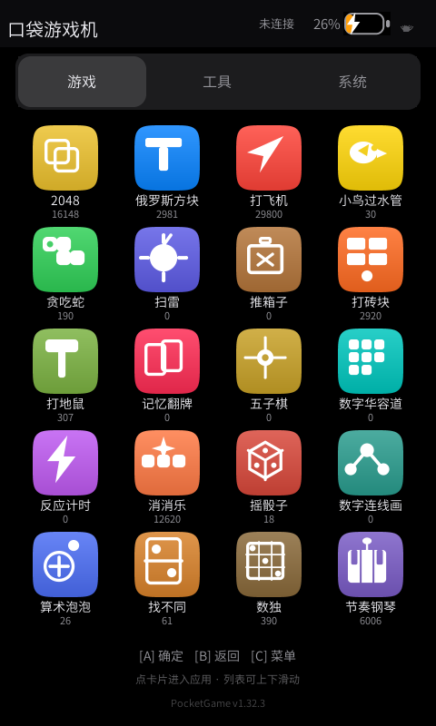
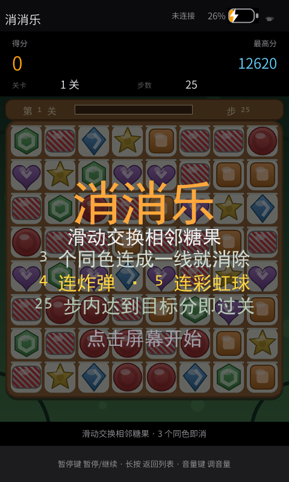
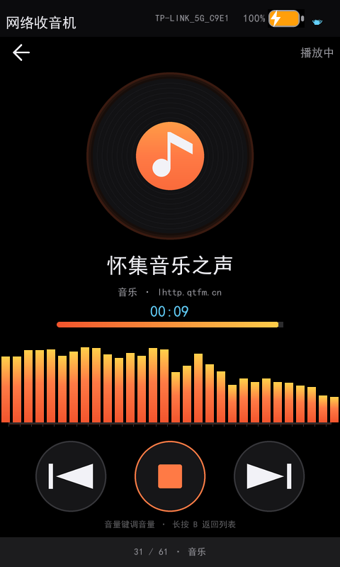
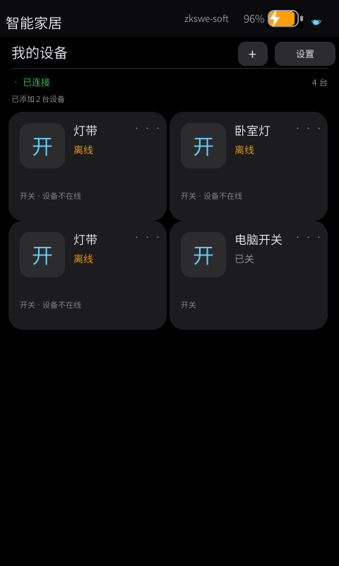

# PocketGame · 掌上游戏机（全志 V85X / 480×800 竖屏）

**中文** ｜ [English](README.en.md)

[](https://www.zkswe.com) [](LICENSE) [](https://github.com/KWolve/FlyThingsMCP)

> **GitHub 主仓** <https://github.com/KWolve/PocketGame> ｜ **Gitee 镜像** <https://gitee.com/Kwolve/PocketGame>

---

## 一句话：3 个按键 + 一块触摸屏，装下 34 个应用

一台**掌心大小**的 **480×800 竖屏掌机**（全志 **V85X** / FlyThings）：
**21 款游戏 + 10 个工具 + 3 个系统页**，启动器按「游戏 / 工具 / 系统」分页。

游戏机、网络收音机、网络电视、局域网摄像头、智能家居遥控器、时钟闹钟、番茄钟计算器、蓝牙遥控……
**全在同一个固件里。开箱即玩，源码全开。**






> 更多截图见 [`docs/screenshots/`](docs/screenshots/)（15 张，全部真机抓屏）。

---

## 1. 为什么选它

| # | 卖点 | 对买家意味着什么 |
|---|---|---|
| 1 | **一机 34 用** | 一块屏顶掉一柜子小电子产品：掌机 + 收音机 + 电视 + 摄像头监视 + 智能家居遥控 + 时钟闹钟 + 计时器。**BOM 省一份、包装省一份、库存省一柜** |
| 2 | **硬件门槛低** | 只要 **3 个物理按键 + 触摸屏 + 喇叭** 就能跑全部 34 个应用 —— 不需要复杂按键阵列，结构与模具成本一起往下压 |
| 3 | **美术全部代码生成** | 图标、卡片、九宫格素材、**离线 PBR 渲染的 3D 桌面宠物**、实拍视频转的像素精灵……**全部由 Python 脚本产出**，可一键重生成、可 diff —— **换皮做客户定制不用等设计外包** |
| 4 | **字库自己瘦身** | 从系统字库裁出「界面实际用到的字」，**10 MB 级压到几百 KB**，直接省 Flash 成本 |
| 5 | **真机能玩，不是 demo 拼盘** | 34 个应用逐版在真机验收：**免触摸自动验收通道**（文件通道下发命令 → 抓屏 → 逐像素比对），不靠"手点一下看看" |
| 6 | **可二次开发** | 纯源码 + **79 篇真机实测文档**（含一份框架踩坑清单）+ 官方 **FlyThings MCP**：加游戏 / 加应用页 / 改界面都有明确路径与检查工具 |
| 7 | **MIT 开源** | 本项目代码 MIT —— 改、卖、二次分发都不用谈授权（第三方组件各自许可，见下） |

---

## 2. 应用一览（34）

**34 个应用 = 21 款游戏 + 10 个工具 + 3 个系统页**，启动器按「游戏 / 工具 / 系统」分类分页。

### 游戏（21）

| 类别 | 应用 |
|---|---|
| 经典 | 2048、俄罗斯方块、打飞机、小鸟过水管、贪吃蛇、扫雷、推箱子、打砖块 |
| 触摸优先 | 打地鼠、记忆翻牌、五子棋、数字华容道、反应计时 |
| 消除 / 趣味 | 消消乐（8×8 三消 + 关卡目标）、摇骰子（3 颗骰子 3D 翻滚） |
| 儿童益智 | 数字连线画（数序）、算术泡泡（心算）、找不同（观察力） |
| 乐器与益智 | 数独、节奏钢琴（下落式跟弹 8 键）、打鼓（下落式跟打 6 鼓位） |

### 工具（10）

番茄时钟 · 定时器 · 秒表 · 计算器 · 蓝牙红外遥控（可学习）·
时钟套件（世界时钟 + 闹钟）· 网络电视（HLS/IPTV）· 信号探针（WiFi/蓝牙探测 + 热点猎手）·
网络收音机（61 台实测电台 + 双声道 VU 表）· 局域网摄像头查看

### 系统（3）

WiFi 状态与设置 · 系统设置 · **智能家居遥控器（Home Assistant）**

### 外加

桌面宠物（离线 PBR 渲染）· 小精灵（实拍视频转画布精灵）· 屏保（诗词 / 像素动画）·
全局导航栏 · 状态栏 · 音量 OSD · **自研拼音输入法**（含九宫格键盘与候选词）

---

## 3. 硬件 / 平台规格

| 项目 | 规格 |
|---|---|
| SoC | 全志 **V851s**（FlyThings 平台标识 `V85X`） |
| 屏 | **480×800 竖屏**（framebuffer 480×1600 双缓冲），电容触摸 |
| 按键 | **3 个物理按键**（`gpio-keys`）+ 触摸屏 |
| 音频 | 板载喇叭（片内 codec `card0`）；另有 I2S 外接 DAC 通路 |
| 无线 | WiFi + 蓝牙 combo（RTL8733BS；蓝牙协议栈 `btstack`：HID / A2DP / SPP） |
| 存储 | `/res` 只读系统分区；支持 **TF 卡外部存储**（投屏与素材落盘优先外置） |
| 电池 | 锂电池：ADC 采样算电量、充电 / 充满检测、低电指示灯、支持软关机 |
| 时间 | **本板无 RTC** —— 联网 NTP 校时（不校时 https 证书判定会失败） |
| 显示方向 | 支持整屏 + 触摸 **180° 实时翻转**（挂绳倒挂场景，一键切换、状态落盘） |
| 系统 | **FlyThings / EasyUI** 应用框架 |
| 升级 | ADB 推写 / `update.img` 固化（TF 卡、插卡自动升级、远程 OTA 通道） |

---

## 4. 上手三步

### ① 补齐依赖（本仓库刻意不含二进制）

```bash
python tools/check_deps.py        # 缺什么直接列出来
```

按 [`docs/DEPENDENCIES.md`](docs/DEPENDENCIES.md) 把 FlyThings 工具链与厂商 SDK 放好。

### ② 编译 / 出包

```bash
fun install                       # 拉取 Manifest.xml 声明的官方包
fun build                         # 编译
fun pack -p V85X --release-version 1.0.0 -o out/update.img   # 出固件包
```

### ③ 刷进设备

```bash
tools/upgrade_device.sh 1.0.0     # 出包 + ADB 刷进设备 + 校验
ITER=1 tools/upgrade_device.sh    # 快速迭代：只推临时目录，不刷机
```

> **红线**：设备上的 `/res` 与 `/dev/mtd*` 是只读系统分区，严禁 `dd` / `mount` / `flash_erase`。
> 唯一正路是 `tools/upgrade_device.sh`。
> 固化烧写的三个真实的坑（多设备时 `fun launch` 必失败、Git Bash 路径转换、
> 固化后设备会自己重启导致分区挂不上）见 [`docs/BUILD.md`](docs/BUILD.md)。

---

## 5. 购买与联系

| 渠道 | 入口 |
|---|---|
| 🏢 公司 | **深圳中科世为科技有限公司**（ZKSWE） |
| 🌐 官网 / 技术文档 | <https://www.zkswe.com> ｜ <https://developer.flythings.cn/> |
| 📞 电话 | 0755-23019045 |
| 📍 地址 | 广东省深圳市宝安区西乡街道共乐社区凤凰智谷 A 座 1407 室 |

> **整机 / 方案 / 定制（换皮、加游戏、改功能）请走公司与电话联系人。**
> 本仓库只提供软件与文档。

---

## 6. 二次开发：需要 FlyThings MCP

本工程的二次开发（改界面 / 加应用 / 编译 / 调试 / 出包 / 真机抓屏 / 知识库检索）依托 **FlyThings MCP** ——
把 MCP 接进你的 AI 客户端（Trae / Cursor / Claude Desktop / Kimi…），**对 AI 说一句话就能干完整条开发链**。
其 **release 版单独维护、单独发布**，本仓只引用、不复制。

| 用途 | 路径 |
|---|---|
| **release 版（用户获取 / 安装处，主）** | <https://github.com/KWolve/FlyThingsMCP> |
| 国内镜像（Gitee） | <https://gitee.com/Kwolve/flythingsmcp_release> |
| 本机路径（同工作区校验用，可选） | `tools/FlyThings_mcp_release/` |

安装与接入方式以该 release 仓的 README 为准（当前 release 版本 `0.27.134-open`，43 个工具）。

**最快上手**：对 AI 说 → 「帮我克隆并安装 `https://github.com/KWolve/FlyThingsMCP`」。

---

## 7. 技术要点

这些是这个工程真正花时间的地方，也是二次开发时最值得参考的部分：

- **软渲染画布**（`src/core/PgCanvas.*`）—— 21 款游戏共用一个不依赖 UI 控件的绘制层。
  画布内容画进内存位图，再挂到控件上由**硬件通道**送上屏幕。
- **自研字库子集 + 字号档位制**（`tools/gen_font.py` → `font/pocketgame.ttf`）——
  从系统字体裁出「界面实际用到的字」，把 10 MB 级字库压到几百 KB。
  画布文字只预烘有限个字号档位，**档位是编译期常量**，避免运行时位图放大造成拉伸。
- **代码生成美术**（`tools/gen_icons.py` / `gen_game_art.py` / `ios_theme.py` / `gen_ha_tiles.py`）——
  所有图标、卡片、磁贴、九宫格圆角素材都由脚本产出，可一键重生成、可 diff。
- **离线 PBR 渲染管线**（`tools/pet3d/`）—— headless Chrome + three.js 渲染 3D 角色，
  再逐帧转换成嵌入式可用的贴图序列。
- **实拍视频 → 画布精灵**（`tools/gen_elf_from_video.py`）—— 逐帧量测 → 抠像 → 统一缩放 → 固定锚点。
- **免触摸真机验收**（QA 通道 + `tools/grab.py` + `tools/pginj` + `tools/audit_resources.py`）——
  通过设备上的文件通道下发命令、抓屏、逐像素比对。整个工程的功能验收都不是"手点一下看看"。
- **全套素材审计工具**（`tools/audit_resources.py`）—— 圆角角行为、九宫格 marker、1:1 铁律、
  未引用素材，7 个维度的自动体检（373 个素材全过）。

以及一份**踩坑清单**：这个框架有不少反直觉的行为（浮层会吃掉触摸、控件在 JSON 里的父节点
**永远是容器**而不是另一个控件、九宫格与透明度是两套规则），都记在
[`docs/框架缺陷与踩坑清单-2026-09-27.md`](docs/框架缺陷与踩坑清单-2026-09-27.md)
和 [`docs/kb-*.md`](docs/README.md) 里（[`docs/README.md`](docs/README.md) 是全部文档的索引），
建议动手前先扫一遍。

---

## 8. 目录结构

```
PocketGame/
├── src/
│   ├── core/           游戏与应用（Pg*.cpp）、软渲染画布、字库运行时
│   ├── logic/          各页面的逻辑（<名>Logic.cc，与 ui/<名>.ftu 同名绑定）
│   ├── platform/       平台能力：音频 / 蓝牙 / 网络 / 流媒体 / 传感器 / 存储
│   ├── media/          WAV 播放等
│   ├── ui/             自绘控件（ToolPage）
│   ├── activity/       主 Activity
│   └── dependencies/   ⚠️ 厂商 SDK 与第三方库，**本仓库不附带**（见其 README）
├── ui/                 界面真值：*.html（设计源稿）→ *.json → *.ftu（设备加载）
├── resources/          素材：images/ audio/ certs/ iptv/ media/
├── font/               项目字库子集（由 tools/gen_font.py 生成）
├── tools/              生成器 + 真机验收工具 + 素材审计
├── docs/               实测文档（含 screenshots/）
├── Manifest.xml        依赖声明（FlyThings 官方包）
├── package.properties  平台配置（分辨率 / 触摸设备 / 屏保超时 / 字库路径）
└── CHANGELOG.md        逐版本开发日志（含每一版的实测数据与原因）
```

**二次开发三条最常见路径**（详见 [`docs/DEVELOPMENT.md`](docs/DEVELOPMENT.md)）：

| 想做什么 | 大概要动什么 |
|---|---|
| **加一款画布游戏** | 写一个 `pg::Game` 子类（`src/core/Pg*.cpp`）+ 在 `PgGames.cpp` 的 `kAppTable` **表尾加一行** |
| **加一个应用页** | 新建 `ui/<名>.html` + `src/logic/<名>Logic.cc` + **同步 6 处注册点**（清单在文档里，漏一处就是静默 bug） |
| **改界面外观** | 改 `ui/*.html` → 跑 `tools/gen_ui.py` →（文案变了再跑）`tools/gen_font.py` |

---

## 9. 关于本仓库的边界

本仓库是**纯源码 + 纯文档**，刻意不含任何二进制：

| 不含 | 原因 | 怎么补 |
|---|---|---|
| 全志 V85X SDK 头文件与静态库 | 厂商 SDK，分发以厂商协议为准 | [`docs/DEPENDENCIES.md`](docs/DEPENDENCIES.md) §B1 |
| ffmpeg / OpenSSL 等第三方库 | 再分发受各自许可证约束 | 同上 §B2 / §B3 |
| FlyThings 工具链（`fun` / `fui.exe`） | 专有工具（约 38 MB） | 装 FlyThings IDE |
| 构建产物（`out/`、`.fun/`、`Release/`） | 可由源码重新生成 | `fun build` |

**因此：克隆下来不能立刻编译**，要先按上表补齐依赖（`python tools/check_deps.py` 会告诉你差什么）。

少数工具脚本里带有原作者机器上的默认路径（如 `D:\zkswe\...`），
已经全部改成可用环境变量覆盖：`PG_ADB`、`PG_HTML2JSON`、`PG_MCP_UI_TOOLS`、`PG_MCP_FONTS`、
`PG_SERIAL`、`ZKSWE_MCP_FONTS`。

---

## 10. 已知限制 / 前提（先说清楚，免得踩坑）

- **无 RTC**：掉电不保时，必须联网校时；离线场景下时间类应用（时钟 / 闹钟）依赖最后一次同步结果
- **克隆不能直接编译**：厂商 SDK / 工具链 / 第三方库不入仓，需按 §9 补齐
- **部分能力有前提**：网络电视 / 收音机 / 摄像头查看 / 智能家居遥控需要 WiFi；蓝牙遥控需要板载蓝牙模组已 bring-up
- **素材与文档口径**：`docs/` 里的实测结论来自本工程目标板（V851s + 480×800），**换板必须按对应文档逐项重测**

---

## 11. 文档

| 从这里开始 | |
|---|---|
| [`docs/BUILD.md`](docs/BUILD.md) | 编译 / 打包 / 烧写 |
| [`docs/DEPENDENCIES.md`](docs/DEPENDENCIES.md) | 依赖获取 |
| [`docs/DEVELOPMENT.md`](docs/DEVELOPMENT.md) | 二次开发指南 |
| [`docs/README.md`](docs/README.md) | **全部 79 篇文档的索引** |
| [`docs/screenshots/`](docs/screenshots/) | 15 张真机截图（启动器三页 + 各应用主界面） |
| [`CHANGELOG.md`](CHANGELOG.md) | 逐版本开发日志（每个版本都带实测数据与结论） |

---

## 12. 许可证

本项目代码以 **MIT** 许可发布 —— 见 [`LICENSE`](LICENSE)。

通过 FlyThings 包管理器和厂商 SDK 引入的第三方组件（EasyUI 框架、ffmpeg、OpenSSL、zlib、
civetweb、btstack 等）**不在本仓库内**，其使用与分发请遵守各自的许可证。

---

## 13. 致谢

- UI 框架：[FlyThings / EasyUI](https://www.flythings.cn/)
- 平台：全志 V85X
- 字库基底：思源黑体（Source Han Sans，SIL OFL）
- 离线 3D 渲染：three.js + headless Chrome

---

_深圳中科世为科技有限公司（ZKSWE）· [www.zkswe.com](https://www.zkswe.com) · [developer.flythings.cn](https://developer.flythings.cn/)_
