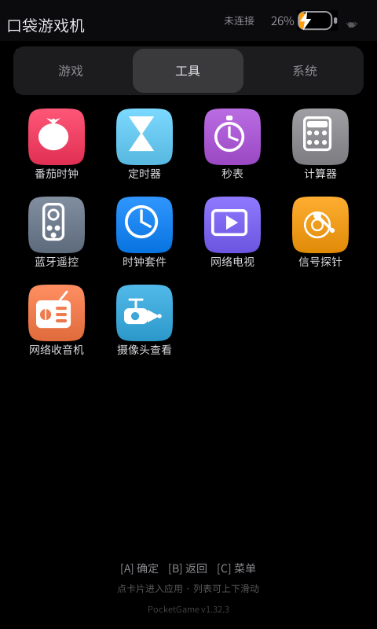
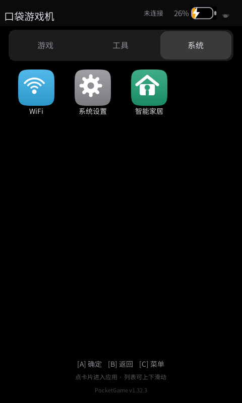
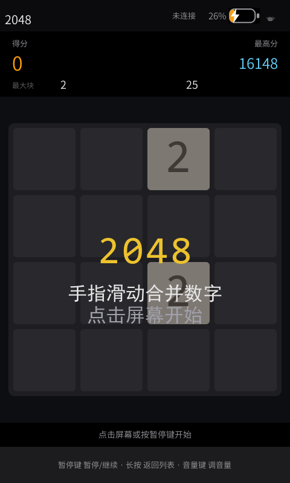
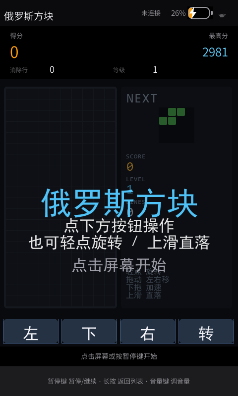
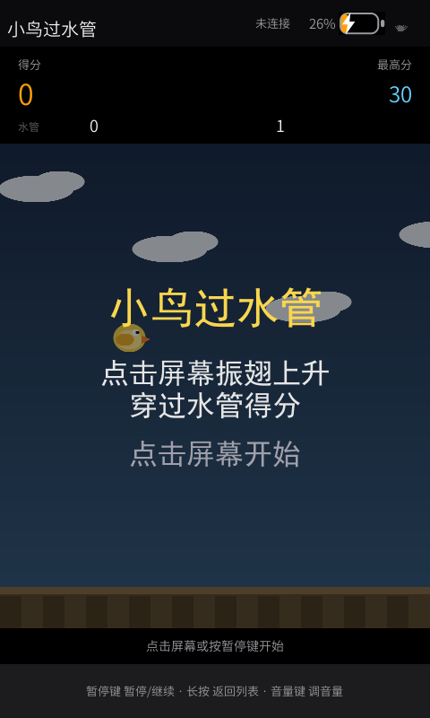
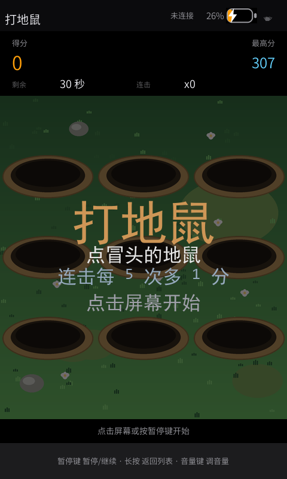
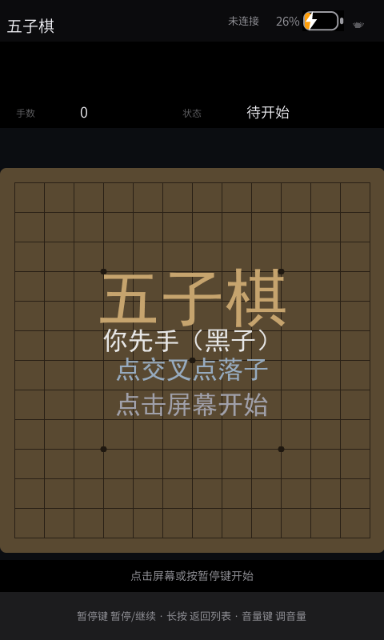
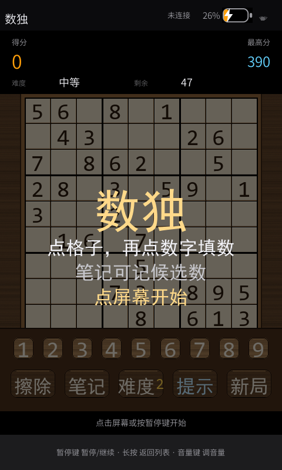
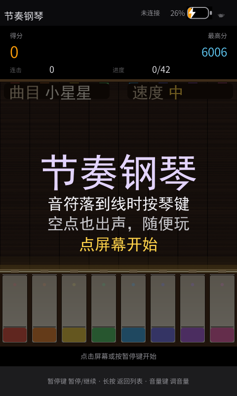
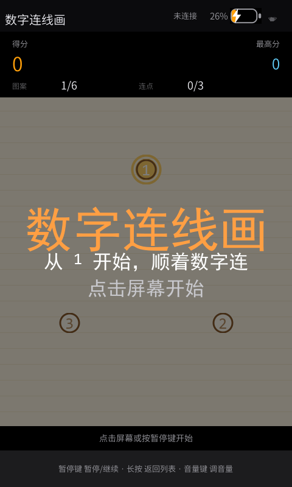

# 真机截图

> 全部是 **480×800 竖屏真机抓屏**（`tools/grab.py` 读 `/dev/fb0`，按 pan 对齐半页），
> 不是设计稿、不是模拟器截图。每个应用只放**主界面**一张。

## 启动器（三个分类页）

| 截图 | 说明 |
|---|---|
|  | `01-launcher-games.png` 启动器主界面 · **游戏页**（21 款游戏，4列×5行网格） |
|  | `02-launcher-tools.png` 启动器主界面 · **工具页**（10 个工具） |
|  | `03-launcher-system.png` 启动器主界面 · **系统页**（WiFi / 系统设置 / 智能家居） |

## 游戏

| 截图 | 说明 |
|---|---|
|  | `10-game-2048.png` 2048 |
|  | `11-game-tetris.png` 俄罗斯方块（含硬降） |
|  | `12-game-flappy.png` 小鸟过水管 |
|  | `13-game-whack.png` 打地鼠（触摸优先·反应类） |
|  | `14-game-gomoku.png` 五子棋（点一下落子） |
|  | `15-game-sudoku.png` 数独（9×9 唯一解 · 三档难度） |
|  | `16-game-piano.png` 节奏钢琴（下落式跟弹 · 8 键） |
|  | `17-game-connect.png` 数字连线画（按 1 2 3… 顺序连点成图） |
|  | `18-game-match3.png` 消消乐（8×8 糖果三消 + 关卡目标） |

## 工具 / 系统应用

| 截图 | 说明 |
|---|---|
|  | `20-radio.png` 网络收音机：播放页（大圆盘 + 真 FFT 频谱，幅度跟随系统音量） |
|  | `21-iptv.png` 网络电视：1080p 直播播放 |
|  | `22-ha.png` 智能家居（Home Assistant 遥控器）：设备列表，含 `unavailable` 灰态 |

> 21 款游戏共用同一个软渲染画布（`src/core/PgCanvas.*`），上面只放用户指定的几款；
> 其余各款见 `src/core/Pg*.cpp`。输入法 / WiFi / 计算器 / 时钟套件 / 信号探针 /
> 桌面宠物 / 小精灵 / 屏保等页面的截图见本地 `docs/` 全量目录。
